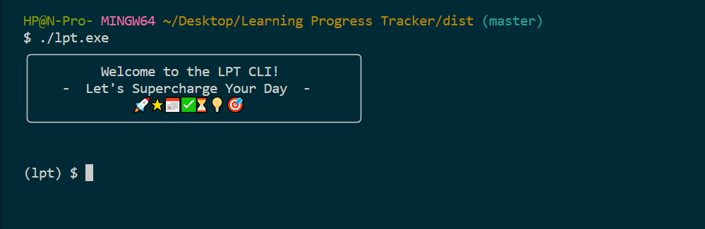
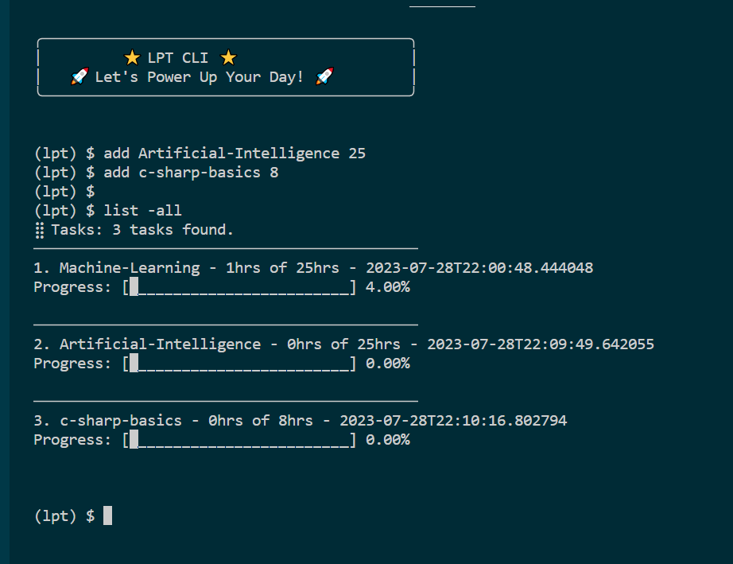
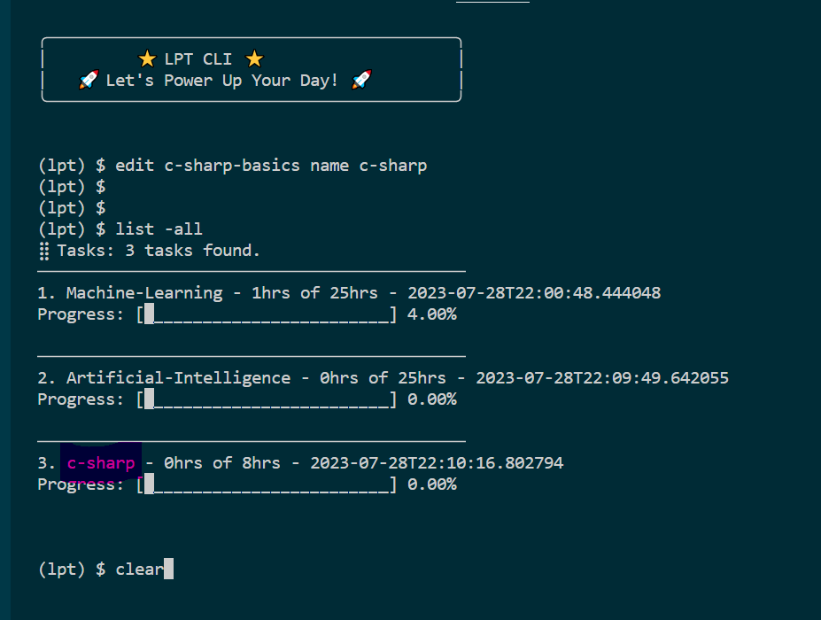
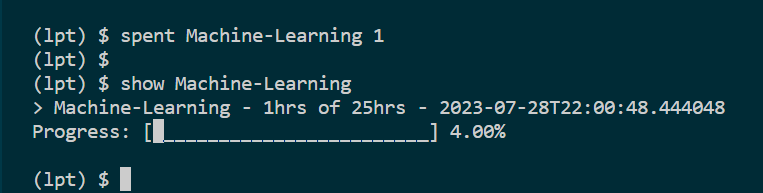
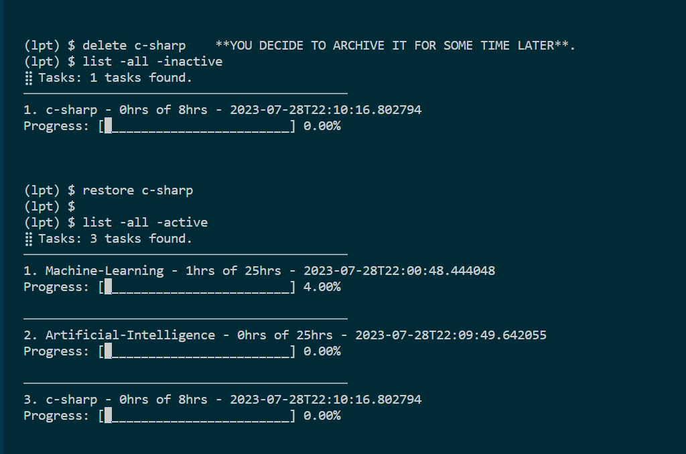
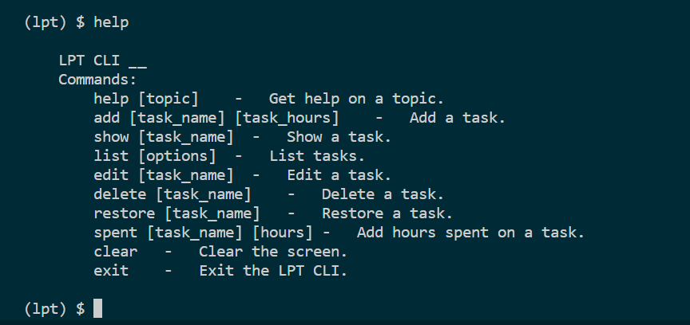
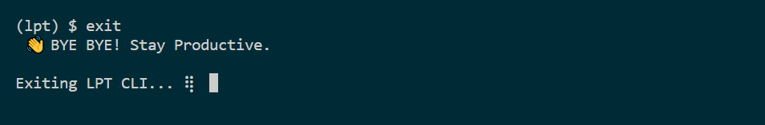

<a id="readme-top"></a>
# Learning Progress Tracker


## About The Project
This is a command line app that tracks your course progress. It is designed to track the number of hours you have spent on a course and the number of hours you have left to complete the course.

<!-- Getting Started -->
## Getting Started
### Install LPT CLI
> Download the executable file and add it to your path.

### Start LPT CLI
```bash
> lpt
```


> This will start the LPT CLI and you will be prompted to enter commands.


<!-- Usage -->
## Usage
### Add Task
```bash
> add <task_name> <total_hours>
```
> This will add a task to the list of tasks. The task name must be unique. The total hours must be a positive integer.

### Show Task
```bash
> show <task_name> [Options]
```
> **Default**: Show task details
> 
> **Options**:
> - `-s` or `-short`: Show a short summary of the task


### List Tasks
```bash
> list [Options]
```

>**Default**: {active} {notcomplete} tasks

>**Options**:
>- `-all`: List all tasks
>- `-active`: List active tasks
>- `-inactive`: List inactive tasks
>- `-completed`: List completed tasks
>- `-notcomplete`: List incomplete tasks

### Edit Task
```bash
> edit <task_name> [Options]
```

Options:
> a attribute value pair. The attribute must be one of the following:
> - `name`: The new name of the task
> - `total_time`: The new total hours of the task
> - `spent_time`: The number of hours spent on the task. Note that you can also use the `spent` command to add hours spent on a task.

### Spend Time on Task
```bash
> spent <task_name> <hours>
```

>This will add the number of hours spent on a task. The hours must be a positive integer.


### Delete Task
```bash
> delete <task_name> [Options]
```
> **Default**: soft delete task. The task will be marked as inactive. (This is like archiving the task)
> 
> **Options**:
> - `-h` or `-hard`: hard delete task. The task will be permanently deleted.

### Restore Task
```bash
> restore <task_name>
```
> This will restore a task that has been deleted (soft deleted), making it active again.



### Clearing console
```bash
> clear
```
> This will clear the console.

### Help
```bash
> help
```


### exit
```bash
> exit
```


> This will exit the LPT CLI.


<a href="#readme-top">
</a>